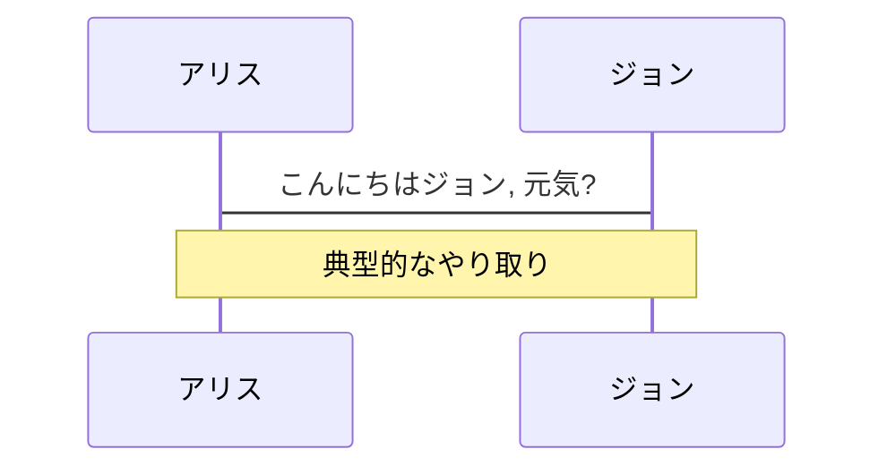
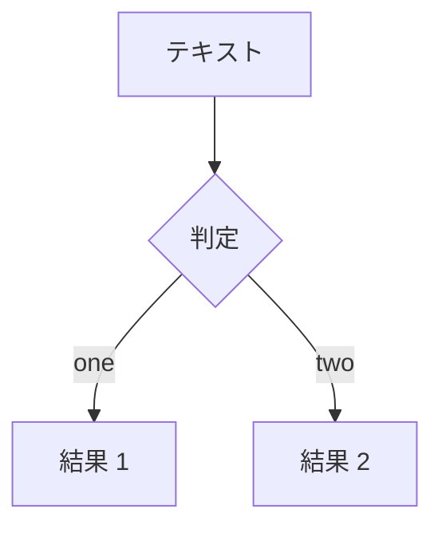
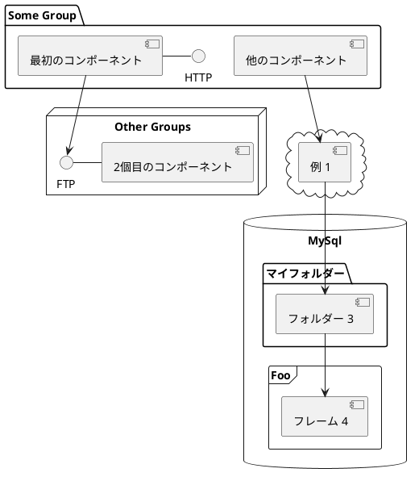

---
# シンプルに始めたいなら'default'を試してください
theme: seriph
# ランダムなイメージはAnthonyのUnsplashのコレクションから選ばれます
# 選ばれるイメージはこちらから確認してください https://unsplash.com/collections/94734566/slidev
background: https://source.unsplash.com/collection/94734566/1920x1080
# 現在のスライドに任意のWindi CSSクラスを適用します
class: 'text-center'
# https://sli.dev/custom/highlighters.html
highlighter: shiki
# コードブロックに行番号を表示する
lineNumbers: false
# スライドに関する情報(マークダウン有効)
info:
  ## Slidev Starter Template
  開発者向けプレゼンテーションスライドです。

  詳しくはこちら [Sli.dev](https://sli.dev)
# エクスポートとビルドで描写を持続させる
drawings:
  persist: false
# UnoCSSを使用する
css: unocss
---

# Welcome to Slidev

Slidevは開発者向けのプレゼンテーションスライドです

<div class="pt-12">
  <span @click="$slidev.nav.next" class="px-2 py-1 rounded cursor-pointer" hover="bg-white bg-opacity-10">
    スペースで次のページへ <carbon:arrow-right class="inline"/>
  </span>
</div>

<div class="abs-br m-6 flex gap-2">
  <button @click="$slidev.nav.openInEditor()" title="Open in Editor" class="text-xl icon-btn opacity-50 !border-none !hover:text-white">
    <carbon:edit />
  </button>
  <a href="https://github.com/slidevjs/slidev" target="_blank" alt="GitHub"
    class="text-xl icon-btn opacity-50 !border-none !hover:text-white">
    <carbon-logo-github />
  </a>
</div>

<!--
各スライドの最後のコメントブロックは、スライドノートとして扱われます。これは、スライドと一緒に Presenter Mode で表示および編集可能です。[詳細はドキュメントをご覧ください](https://ja.sli.dev/guide/syntax.html#notes)
-->

---

# Slidevとは?

Slidevは、開発者向けに設計されたスライド作成ソフトで、以下の機能を備えています。

- 📝 **テキストベース** - マークダウンでコンテンツに集中し、後でスタイルを整えられる
- 🎨 **テーマの切り替え** - テーマは npm パッケージで共有および使用可能
- 🧑‍💻 **開発者フレンドリー** - コードハイライト、オートコンプリートによるライブコーディング可能
- 🤹 **インタラクティブ** - Vue コンポーネントを埋め込んで表現を強化可能
- 🎥 **レコーディング** - 内蔵録画とカメラビューが可能
- 📤 **ポータブル** - PDF、PNG、またはホスティング可能な SPA も出力可能
- 🛠 **改造可能** - ウェブページで出来る事は何でも可能

<br>
<br>

もっと読む [何故 Slidev なのか?](https://ja.sli.dev/guide/why)

<!--
マークダウンでstyleタグを使用すると、現在のページのスタイルを上書きすることができます。
詳しくはこちら: https://sli.dev/guide/syntax#embedded-styles
-->

<style>
h1 {
  background-color: #2B90B6;
  background-image: linear-gradient(45deg, #4EC5D4 10%, #146b8c 20%);
  background-size: 100%;
  -webkit-background-clip: text;
  -moz-background-clip: text;
  -webkit-text-fill-color: transparent;
  -moz-text-fill-color: transparent;
}
</style>

<!--
ここにもコメントが書けます
-->

---

# ナビゲーション
左下にカーソルを合わせると、ナビゲーションのコントロールパネルが表示されます。[詳しく見る](https://ja.sli.dev/guide/navigation.html)
### キーボードのショートカット

|     |     |
| --- | --- |
| <kbd>右矢印</kbd> / <kbd>スペース</kbd>| 次のアニメーションかスライドへ |
| <kbd>左矢印</kbd>  / <kbd>シフト</kbd> <kbd>スペース</kbd> | 前のアニメーションかスライドへ |
| <kbd>上矢印</kbd> | 前のスライドへ |
| <kbd>下矢印</kbd> | 次のスライドへ |

<!-- https://sli.dev/guide/animations.html#click-animations -->

<p v-after class="absolute bottom-23 left-45 opacity-30 transform -rotate-10">ここ!</p>

---
layout: image-right
image: https://source.unsplash.com/collection/94734566/1920x1080
---

# コード

コードスニペットを使って、ハイライトを直接取得してみましょう[^1]

```ts {all|2|1-6|9|all}
interface User {
  id: number
  firstName: string
  lastName: string
  role: string
}

function updateUser(id: number, update: User) {
  const user = getUser(id)
  const newUser = { ...user, ...update }
  saveUser(id, newUser)
}
```

<arrow v-click="3" x1="400" y1="420" x2="230" y2="330" color="#564" width="3" arrowSize="1" />

[^1]: [詳しくはこちら](https://ja.sli.dev/guide/syntax.html#line-highlighting)

<style>
.footnotes-sep {
  @apply mt-20 opacity-10;
}
.footnotes {
  @apply text-sm opacity-75;
}
.footnote-backref {
  display: none;
}
</style>

---

# コンポーネント

<div grid="~ cols-2 gap-4">
<div>

Vue のコンポーネントをスライド内で直接使用することができます。

コンポーネントとして `<Tweet/>` や `<Youtube/>` が用意されているので、直接使用することができます。また、カスタムコンポーネントを追加するのも非常に簡単です。

```html
<Counter :count="10" />
```

<!-- ./components/Counter.vue -->
<Counter :count="10" m="t-4" />

詳しくは [ガイド](https://sli.dev/builtin/components.html) をご覧ください。

</div>
<div>

```html
<Tweet id="1390115482657726468" />
```

<Tweet id="1390115482657726468" scale="0.65" />

</div>
</div>

<!--
プレゼンター用のコメントでは**太字**、*斜体*、~~取り消し線~~が使えます。

またHTML要素も使用可能です:
<div class="flex w-full">
  <span style="flex-grow: 1;">左のコンテンツ</span>
  <span>右のコンテンツ</span>
</div>
-->


---
class: px-20
---

# テーマ

Slidev は強力なテーマ化サポートを備えています。
テーマはスタイル、レイアウト、コンポーネント、あるいはツールの設定を提供することができます。Frontmatterで**編集**するだけで、テーマを切り替えることができます。

<div grid="~ cols-2 gap-2" m="-t-2">

```yaml
---
theme: default
---
```

```yaml
---
theme: seriph
---
```


</div>

詳しくは [テーマを使用する](https://ja.sli.dev/themes/use.html) と
 [テーマギャラリー](https://ja.sli.dev/themes/gallery.html)を確認してください。

---
preload: false
---

# アニメーション

アニメーションは [@vueuse/motion](https://motion.vueuse.org/) を利用しています.

```html
<div
  v-motion
  :initial="{ x: -80 }"
  :enter="{ x: 0 }">
  Slidev
</div>
```

<div class="w-60 relative mt-6">
  <div class="relative w-40 h-40">
    
    
    
  </div>

  <div
    class="text-5xl absolute top-14 left-40 text-[#2B90B6] -z-1"
    v-motion
    :initial="{ x: -80, opacity: 0}"
    :enter="{ x: 0, opacity: 1, transition: { delay: 2000, duration: 1000 } }">
    Slidev
  </div>
</div>

<!-- vue script setup scripts can be directly used in markdown, and will only affects current page -->
<script setup lang="ts">
const final = {
  x: 0,
  y: 0,
  rotate: 0,
  scale: 1,
  transition: {
    type: 'spring',
    damping: 10,
    stiffness: 20,
    mass: 2
  }
}
</script>

<div
  v-motion
  :initial="{ x:35, y: 40, opacity: 0}"
  :enter="{ y: 0, opacity: 1, transition: { delay: 3500 } }">

[詳しくはこちら](https://ja.sli.dev/guide/animations.html#motion)

</div>

---

# LaTeX
LaTeXは [KaTeX](https://katex.org/) によって追加設定無しでサポートされています。

<br>

インライン形式 $\sqrt{3x-1}+(1+x)^2$

ブロック形式
$$
\begin{array}{c}

\nabla \times \vec{\mathbf{B}} -\, \frac1c\, \frac{\partial\vec{\mathbf{E}}}{\partial t} &
= \frac{4\pi}{c}\vec{\mathbf{j}}    \nabla \cdot \vec{\mathbf{E}} & = 4 \pi \rho \\

\nabla \times \vec{\mathbf{E}}\, +\, \frac1c\, \frac{\partial\vec{\mathbf{B}}}{\partial t} & = \vec{\mathbf{0}} \\

\nabla \cdot \vec{\mathbf{B}} & = 0

\end{array}
$$

<br>

[詳しくはこちら](https://ja.sli.dev/guide/syntax#latex)

---

# 図表

マークダウンで直接、テキスト記述から図/グラフを作成することができます。

<div class="grid grid-cols-3 gap-10 pt-4 -mb-6">







</div>

[詳しくはこちら](https://ja.sli.dev/guide/syntax.html#diagrams)

---
src: ./pages/multiple-entries.md
hide: false
---

---
layout: center
class: text-center
---

# 詳しくはこちら

[英語ドキュメント](https://sli.dev) · [日本語ドキュメント](https://ja.sli.dev) · [GitHub](https://github.com/slidevjs/slidev) · [ショーケース](https://sli.dev/showcases.html)
